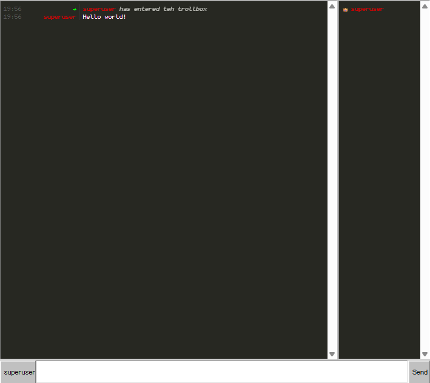

Open-source WIN93's trollbox created in scratch for fun and learning purposes. Based on Node.js, and Socket.IO

# Installation

1. Clone the repository
2. Run `npm install`
3. Run `npm start`
4. Finish the setup process
5. Open `http://localhost:8080` in your browser
# License
No license.